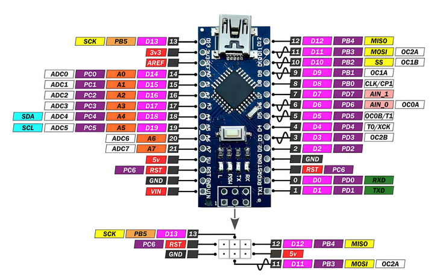

# Recovering an Arduino Nano with a Broken Crystal Oscillator

This project documents the recovery of an ATmega328P microcontroller on an Arduino Nano board with a failed external or internal clock source.

## 🛠 Symptoms:

* Unable to upload via USB or ISP.
* ISP connection shows `Device signature = 0x000000` or doesn’t detect the chip.
* avrdude shows `programmer is not responding`, `invalid device signature`, or `protocol error`.

## 📦 Requirements:

* A working Arduino UNO (or Nano) as programmer.
* A second Arduino (Nano) as an external clock generator.
* Jumper wires.
* Optiboot bootloader.
* avrdude and MiniCore installed.

## 🧭 Pinouts

Before wiring, please refer to the pinouts below to identify the correct pins:

### ATmega328P Pinout


### Arduino Nano Pinout


## 🔄 Wiring Overview:

**Clock generator (Nano)**:

* D9 → XTAL1 (pin 7 on ATmega328P).
* GND → GND of the broken chip board.

**Programmer (UNO)**:

* Connect via ISP:

  * D10 → RESET
  * D11 → MOSI
  * D12 → MISO
  * D13 → SCK
  * GND and VCC

## ⚙ Generating 8 MHz signal (clock sketch):

```cpp
void setup() {
  pinMode(9, OUTPUT);
  TCCR1A = _BV(COM1A0);
  TCCR1B = _BV(WGM12) | _BV(CS10);
  OCR1A = 0;
}
void loop() {}
```

## 🧪 Check connection:

```bash
avrdude -C "path/to/avrdude.conf" -c arduino -p m328p -P COMx -b 19200
```

Expected response: signature `1E 95 0F`

## 🔥 Flash bootloader:

```bash
avrdude -C "..." -p m328p -c arduino -P COMx -b 19200 \
  -U flash:w:optiboot_flash_atmega328p_UART0_9600_8000000L_B5.hex
```

## 📥 Get the bootloader:

Use [optiboot_flash](https://github.com/MCUdude/MiniCore/tree/master/avr/bootloaders/optiboot_flash)

## 🧠 Tips:

* Always share GND between all boards.
* If signature is 0x000000 — clock issue is almost certain.
* Make sure clock is exactly 8 MHz, otherwise the bootloader won’t function properly.

## ✍ Author

Created by Dovegs to help others restore non-working Arduino boards.

---

👉 Читайте версию на русском: [README\_RU.md](README_RU.md)
