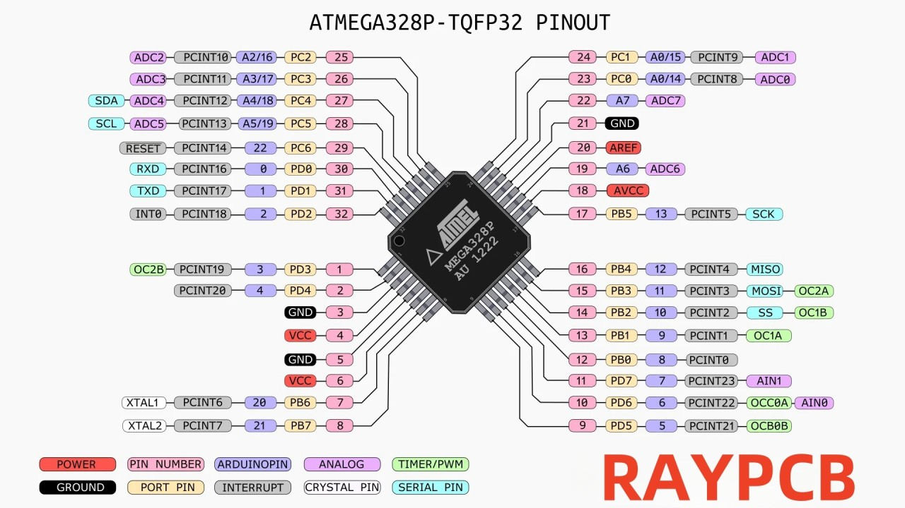

# Восстановление Arduino Nano с повреждённым кварцевым резонатором

Этот проект посвящён восстановлению микроконтроллера ATmega328P на плате Arduino Nano, у которого вышел из строя кварцевый резонатор или встроенный генератор.

## 🛠 Признаки неисправности:

* Не удаётся прошить через USB или через программатор.
* Подключение через ISP выдаёт `Device signature = 0x000000` или не определяется вовсе.
* avrdude пишет `programmer is not responding`, `invalid device signature` или `protocol error`.

## 📦 Что нужно:

* Рабочая Arduino UNO (или Nano) — как программатор.
* Вторая Arduino (Nano) — как генератор тактовой частоты.
* Соединительные провода.
* Прошивка загрузчика (например, Optiboot).
* avrdude и установленный MiniCore.

## 🧭 Распиновка

Перед подключением проводов ознакомьтесь с приведенными ниже распиновками, чтобы определить правильные пины:

### ATmega328P Распиновка


### Arduino Nano Распиновка


## 🔄 Общая схема подключения:

**Генератор частоты (Nano)**:

* Пин D9 → XTAL1 (пин 9 на ATmega328P).
* GND → GND платы с неисправным чипом.

**Программатор (UNO)**:

* Подключение по ISP:

  * D10 → RESET
  * D11 → MOSI
  * D12 → MISO
  * D13 → SCK
  * GND и VCC

## ⚙ Генерация 8 МГц сигнала (скетч для генератора):

```cpp
void setup() {
  pinMode(9, OUTPUT);
  TCCR1A = _BV(COM1A0);
  TCCR1B = _BV(WGM12) | _BV(CS10);
  OCR1A = 0;
}
void loop() {}
```

## 🧪 Проверка связи:

```bash
avrdude -C "path/to/avrdude.conf" -c arduino -p m328p -P COMx -b 19200
```

Если всё работает, вы увидите корректную сигнатуру: `1E 95 0F`

## 🔥 Прошивка загрузчика:

```bash
avrdude -C "..." -p m328p -c arduino -P COMx -b 19200 \
  -U flash:w:optiboot_flash_atmega328p_UART0_9600_8000000L_B5.hex
```

## 📥 Где взять загрузчик:

Рекомендуется использовать [optiboot_flash](https://github.com/MCUdude/MiniCore/tree/master/avr/bootloaders/optiboot_flash)

## 🧠 Советы:

* Никогда не прошивай без общего GND между всеми платами.
* Если сигнатура 0x000000 — почти всегда проблема с тактированием.
* Убедись, что частота точно 8 МГц, иначе загрузчик не стартует корректно.

## ✍ Автор

Создано пользователем Dovegs, чтобы помочь другим в восстановлении неисправных Arduino.

---

👉 Версия на английском языке: [README\_EN.md](README_EN.md)
